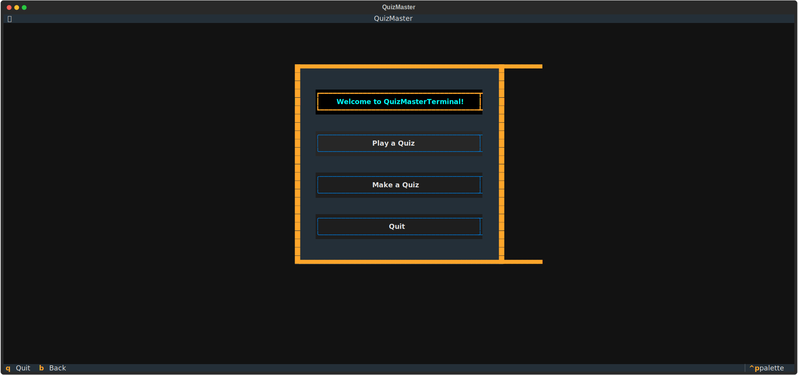

# QuizMasterTerminal

QuizMasterTerminal is a terminal-based version of [QuizMaster](https://github.com/hermonochy/QuizMaster), using Textual for its UI. QuizMasterTerminal allows users to create and play quizzes directly from the terminal. It is ideal for environments where graphical interfaces are not available or desired.



## How to Use

### Installation

1. Clone this repository via terminal: ```git clone --recurse-submodules https://github.com/hermonochy/QuizMaster```

  If you prefer not to include the example quizzes, you can omit the `--recurse-submodules` flag: ```git clone https://github.com/hermonochy/QuizMaster```
   
 2. Enter the directory containing the game executable:
    ```sh
    cd QuizMasterTerminal
    ```

 3. Download the requirements:
    ```sh
    pip install -r requirements.txt
    ```   

4. Start playing!.

## Playing

1. In a command line window, enter `./QuizMaster` for Linux, `python QuizMaster` for Windows.
2. Click on the desired button and follow the prompts to play or make your quiz!

## Features

- **Play a Quiz:** Select and play quizzes.
- **Make a Quiz:** Create, edit, and save quizzes.
- **TUI Window:** All interactions are handled through the TUI.

Enjoy creating and playing quizzes with QuizMasterTerminal!
